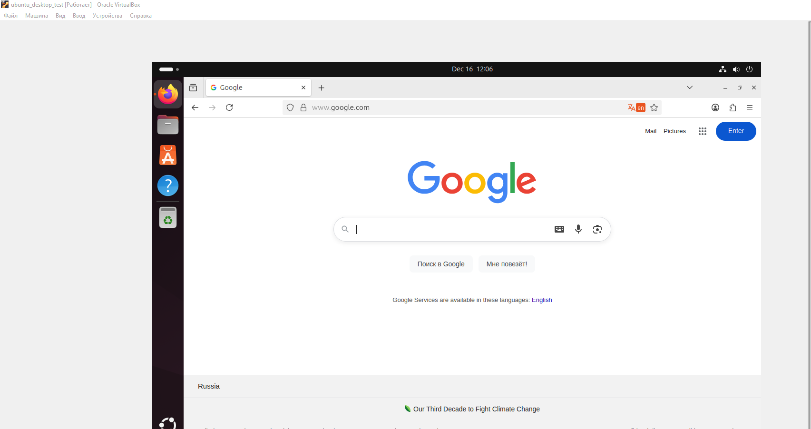
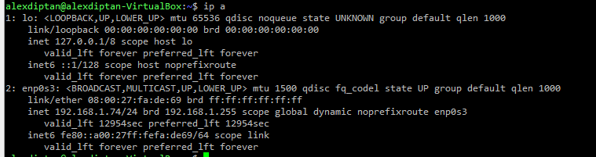

# Подзадание 1: Установка Ubuntu, настройка сети, Samba, SSH

**Статус:** ✅ Выполнено (из архива)

---

## Задание 1

### 1. Убунту установил:



---

### 2. Настроить:

#### Настроил сеть



#### Samba настроена


---

### 3. Обновил систему и установил обновления

**Команда:**
```bash
apt-get update -y && apt-get upgrade -y
```

---

### 4. Сгенерил ключ и подключился к машине по SSH


---

[◀ Назад к Заданию 1](./README.md)
