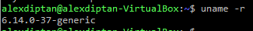
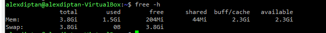
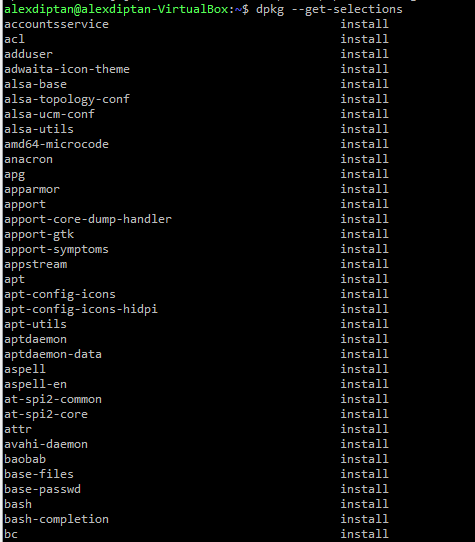
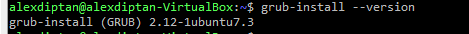
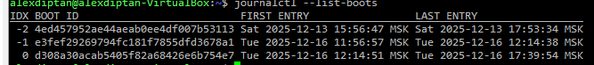
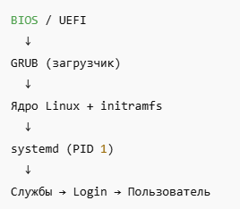

# Подзадание 2: Процесс загрузки Linux системы

**Статус:** ✅ Выполнено (из архива)

---

## Задание 2

### 1. Этап 1

---

### 2. Этап 2

---

### 3. Этап 3

---

### 4. Этап 4

---

### 5. Этап 5

---

### 6. Процесс загрузки системы:

---

[◀ Назад к Заданию 1](./README.md)
