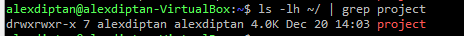
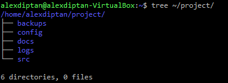
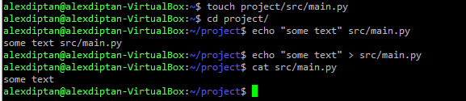
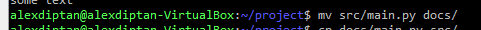
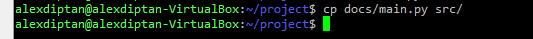

# Подзадание 1: Работа с системой

**Статус:** ✅ Выполнено (из архива)

---

## Задание 2.1

### 1. Пункт 1

---

### 2. Пункт 2

---

### 3. Пункт 3

---

### 4. Пункт 4

---

### 5. Пункт 5

---

[◀ Назад к Заданию 2](./README.md)
