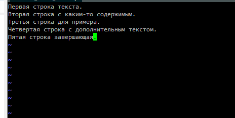
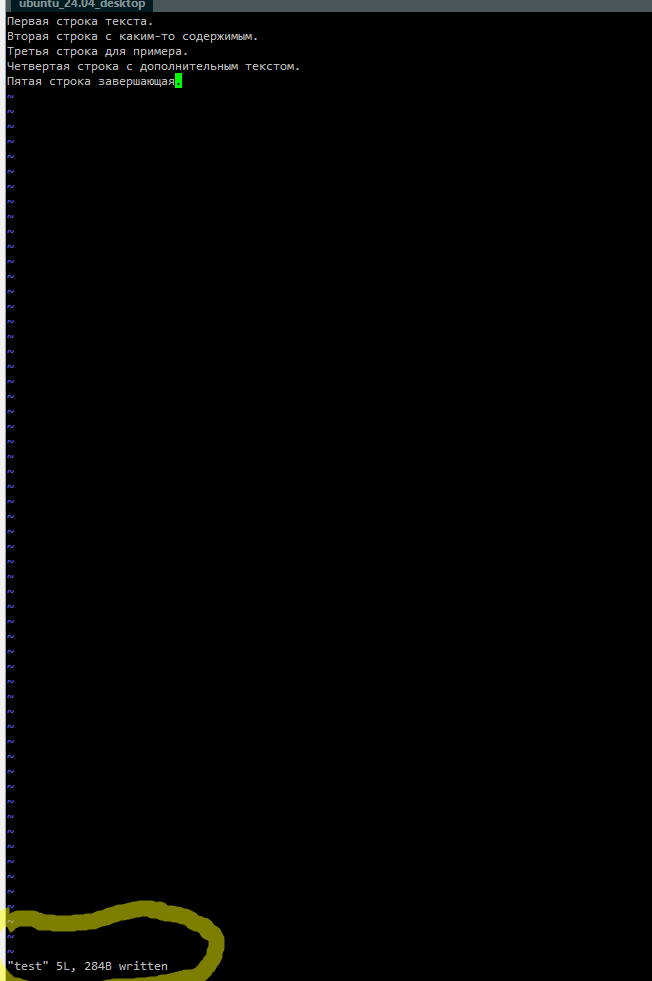
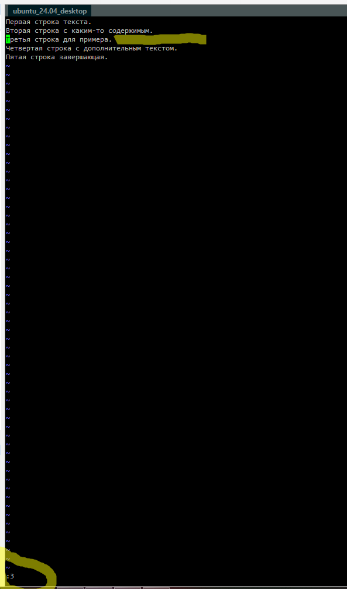
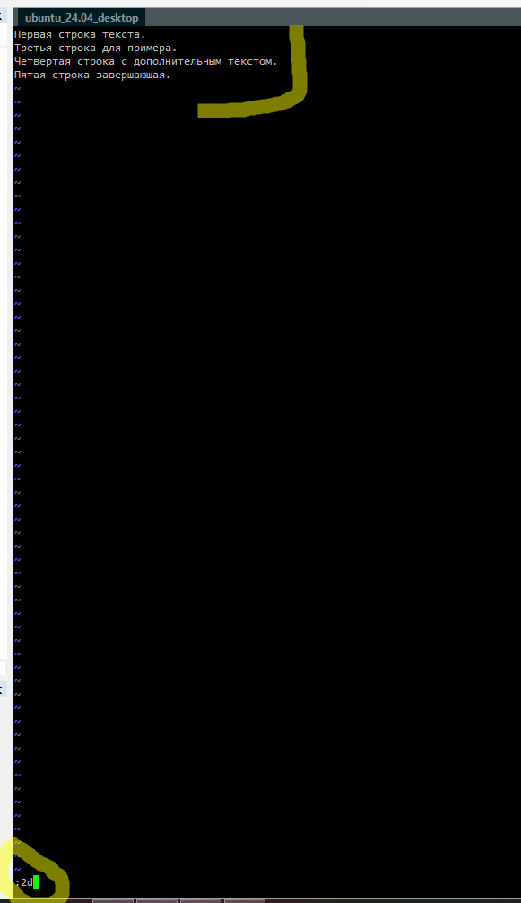
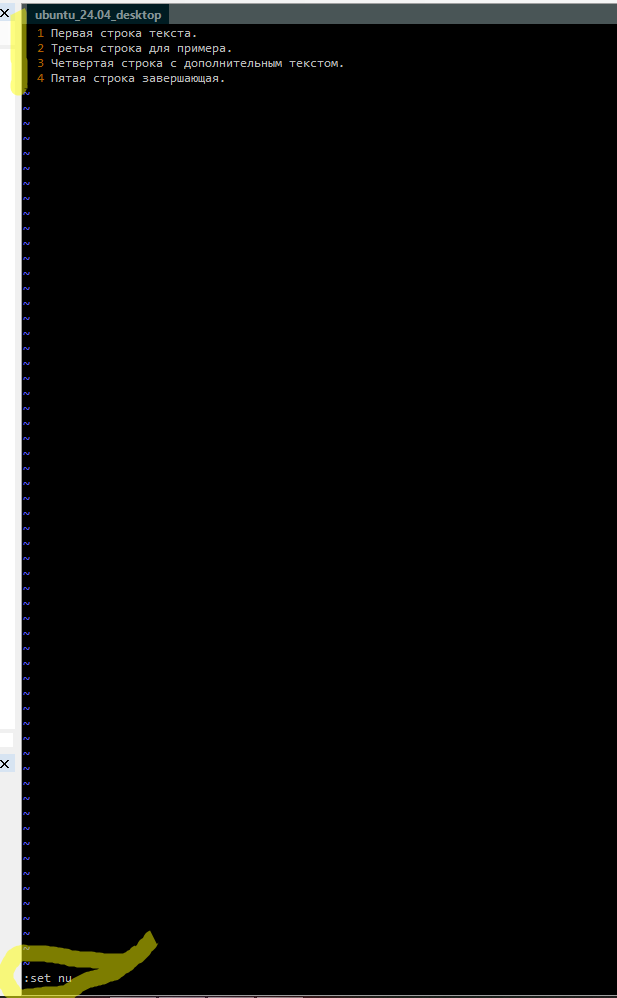
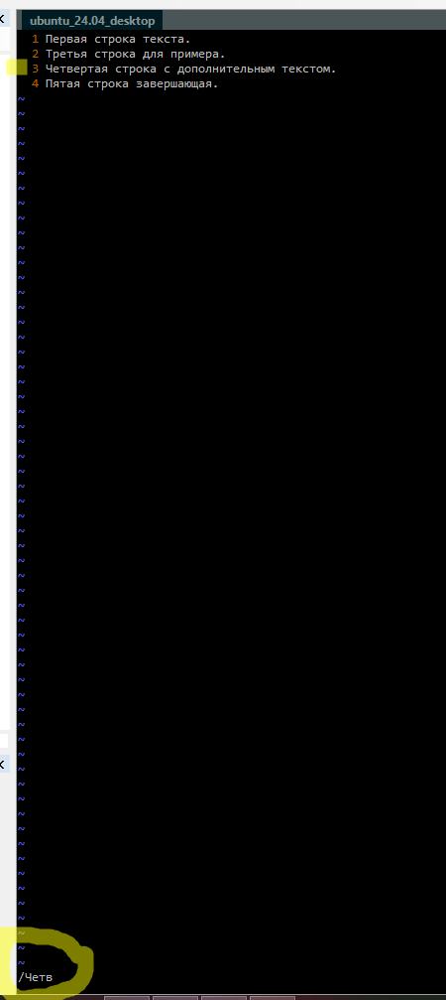

# Подзадание 4: Работа с текстовым редактором Vim

**Статус:** ✅ Выполнено (из архива)

---

## Задание 2.4: Vim

### 1. Скриншот 1


---

### 2. Скриншот 2



---

### 3. Скриншот 3



---

### 4. Скриншот 4



---

### 5. Скриншот 5



---

### 6. Скриншот 6



---

### 7. Скриншот 7



---

## Команды Vim

### 8. Полезные команды

```vim
:set syntax=python  # Включить подсветку синтаксиса для Python
:split              # Разделить окно горизонтально
:vsplit             # Разделить окно вертикально
:help               # Открыть справку
u                   # Отменить последнее действие
Ctrl+r              # Повторить отмененное действие
:%s/старое/новое/g  # Заменить все вхождения "старое" на "новое"
yy                  # Копировать текущую строку
p                   # Вставить скопированную строку
:set wrap           # Включить перенос строк
:set nowrap         # Выключить перенос строк
```

---

[◀ Назад к Заданию 2](./README.md)
