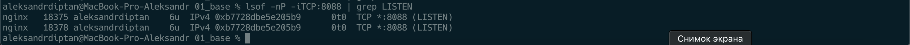
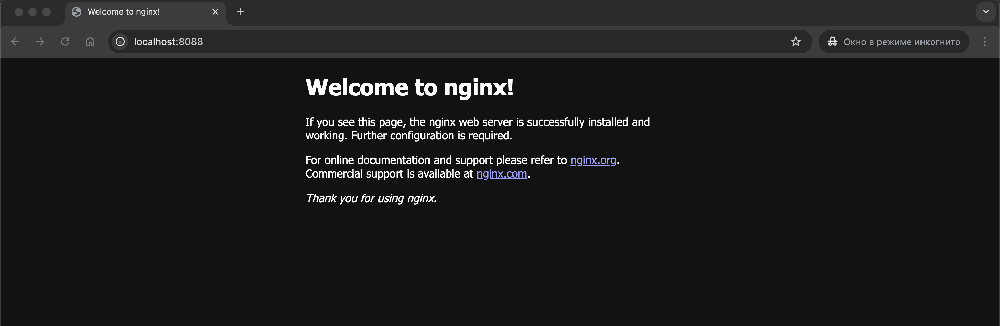

# Задание 1: Установка Nginx

**Статус:** ✅ Выполнено  
**Дата:** 2026-03-07  
**Платформа:** macOS

---

## Описание задания

Установить веб-сервер Nginx на macOS, запустить его и убедиться в корректной работе. Проверить, что Nginx слушает на порту 8088 и отображает стандартную приветственную страницу.

---

## Выполнение

### 1. Установка Nginx через Homebrew

**Команды:**
```bash
# Установка Nginx
brew install nginx

# Создание необходимых директорий для временных файлов
sudo mkdir -p /opt/homebrew/var/run/nginx/{client_body_temp,proxy_temp,fastcgi_temp,uwsgi_temp,scgi_temp}

# Установка прав доступа
sudo chown -R $(whoami):staff /opt/homebrew/var/run/nginx

# Запуск Nginx
brew services start nginx
```

**Результат:** Nginx установлен и запущен как системный сервис.

---

### 2. Проверка прослушиваемого порта

**Команда:**
```bash
lsof -nP -iTCP:8088 | grep LISTEN
```

**Описание:** Проверяем, что Nginx слушает на порту 8088 (нестандартный порт, так как 8080 был занят другим сервисом).



**Результат:**
- Процесс nginx master (PID 18375) слушает на порту `*:8088`
- Процесс nginx worker (PID 18378) также слушает на этом же порту
- Подтверждение: Nginx запущен и доступен на порту 8088

---

### 3. Проверка доступности в браузере

**URL:** `http://localhost:8088`

**Описание:** Открываем браузер и переходим по адресу локального хоста на порту 8088.



**Результат:**
- Браузер отображает стандартную приветственную страницу **"Welcome to nginx!"**
- Подтверждение: Nginx успешно обрабатывает HTTP-запросы
- Порт и адрес совпадают с тем, что показывает команда `lsof`

---

## Итоги

✅ **Выполнено:**
- Nginx установлен через Homebrew
- Сервис запущен и работает на порту 8088
- Команда `lsof` подтверждает прослушивание порта
- Браузер отображает стандартную страницу Nginx
- Порт в команде и в браузере совпадают

**Следующий шаг:** [Задание 2 - Настройка виртуального хоста](./zadanie_2.md)

---

[◀ Назад к списку заданий](./README.md)
