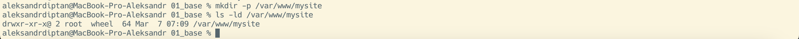
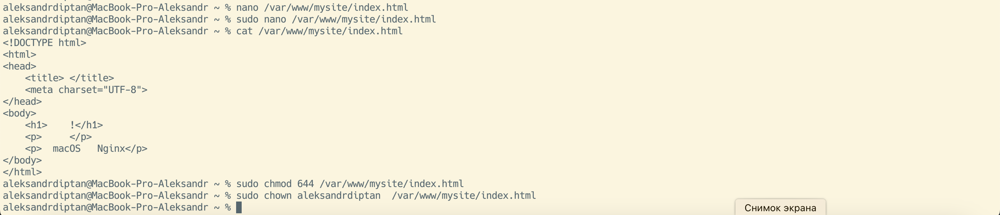
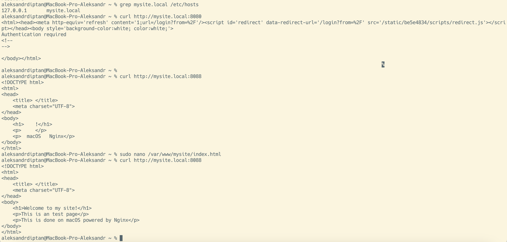
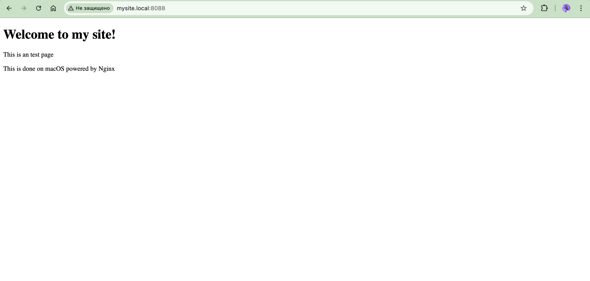
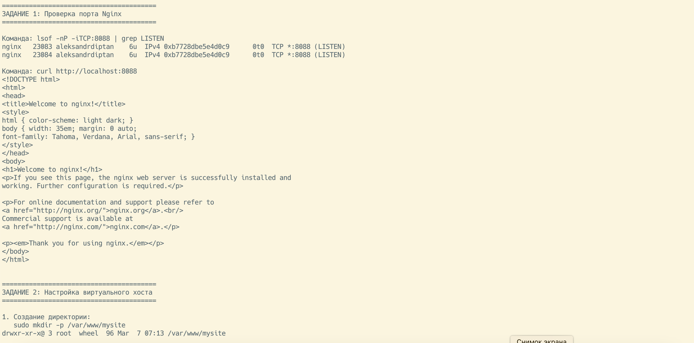
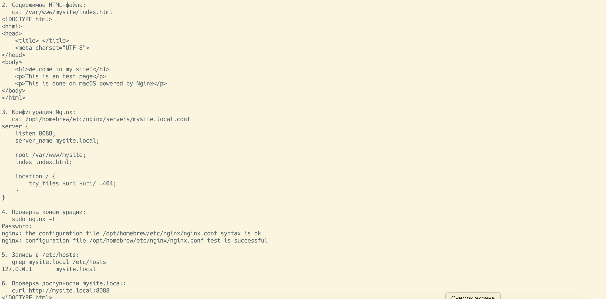
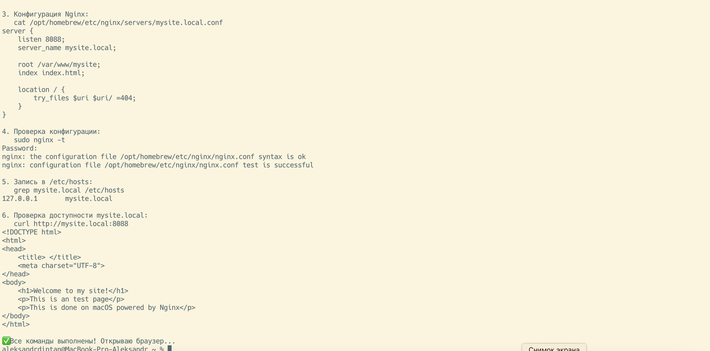

# Задание 2: Настройка виртуального хоста

**Статус:** ✅ Выполнено  
**Дата:** 2026-03-07  
**Платформа:** macOS

---

## Описание задания

Настроить виртуальный хост в Nginx для кастомного доменного имени `mysite.local`:
- Создать отдельную директорию для сайта
- Подготовить HTML-файл с приветственной страницей
- Настроить конфигурацию Nginx для обслуживания виртуального хоста
- Добавить запись в файл `/etc/hosts` для локального разрешения домена
- Проверить доступность сайта через `curl` и браузер

---

## Выполнение

### 1. Создание директории для сайта

**Команда:**
```bash
sudo mkdir -p /var/www/mysite
```

**Проверка:**
```bash
ls -ld /var/www/mysite
```



**Результат:**
- Директория `/var/www/mysite` создана
- Права доступа: `drwxr-xr-x@` (владелец: root, группа: wheel)
- Директория будет использоваться как корневая для виртуального хоста

---

### 2. Создание HTML-файла

**Команда:**
```bash
sudo nano /var/www/mysite/index.html
```

**Содержимое файла:**
```html
<!DOCTYPE html>
<html>
<head>
    <title> </title>
    <meta charset="UTF-8">
</head>
<body>
    <h1>Welcome to my site!</h1>
    <p>This is an test page</p>
    <p>This is done on macOS powered by Nginx</p>
</body>
</html>
```

**Установка прав доступа:**
```bash
sudo chmod 644 /var/www/mysite/index.html
sudo chown aleksandrdiptan /var/www/mysite/index.html
```

**Проверка содержимого:**
```bash
cat /var/www/mysite/index.html
```



**Результат:**
- HTML-файл создан с приветственным текстом
- Установлены корректные права на чтение (644)
- Владелец изменён для удобства редактирования

---

### 3. Настройка конфигурации Nginx

**Путь к конфигурации:** `/opt/homebrew/etc/nginx/servers/mysite.local.conf`

**Команда:**
```bash
sudo nano /opt/homebrew/etc/nginx/servers/mysite.local.conf
```

**Содержимое конфигурационного файла:**
```nginx
server {
    listen 8088;
    server_name mysite.local;

    root /var/www/mysite;
    index index.html;

    location / {
        try_files $uri $uri/ =404;
    }
}
```

**Проверка синтаксиса конфигурации:**
```bash
sudo nginx -t
```

**Перезапуск Nginx:**
```bash
brew services restart nginx
```

**Результат:**
- Создана конфигурация виртуального хоста для домена `mysite.local`
- Nginx слушает на порту 8088 для этого домена
- Синтаксис конфигурации проверен (`nginx: configuration file ... test is successful`)
- Nginx перезапущен для применения изменений

---

### 4. Добавление записи в /etc/hosts

**Команда:**
```bash
echo "127.0.0.1 mysite.local" | sudo tee -a /etc/hosts
```

**Проверка:**
```bash
grep mysite.local /etc/hosts
```

**Результат:**
- Добавлена запись `127.0.0.1 mysite.local` в файл `/etc/hosts`
- Доменное имя `mysite.local` теперь указывает на локальный адрес 127.0.0.1

---

### 5. Проверка через curl

**Первая попытка (неверный порт 8080):**
```bash
curl http://mysite.local:8080
```

**Результат:** Ошибка — получена страница с редиректом/аутентификацией (порт 8080 занят другим сервисом, вероятно Jenkins).

**Правильный запрос (порт 8088):**
```bash
curl http://mysite.local:8088
```



**Результат:**
- `curl http://mysite.local:8088` успешно возвращает HTML-код кастомной страницы
- Текст содержит: "Welcome to my site!", "This is an test page", "This is done on macOS powered by Nginx"
- Виртуальный хост корректно обслуживает запросы по доменному имени

---

### 6. Проверка в браузере

**URL:** `http://mysite.local:8088`



**Результат:**
- Браузер успешно открывает кастомную страницу по адресу `mysite.local:8088`
- Отображается приветственный текст: **"Welcome to my site!"**
- Подтверждение: виртуальный хост работает корректно
- Доменное имя отличается от `localhost` (выполнено требование задания)

---

## Итоговый отчёт (автоматизированная проверка)

Для удобства проверки был создан скрипт, объединяющий все команды и выводящий результаты:

### Часть 1: Проверка Задания 1 + начало Задания 2



**Содержание:**
- Проверка порта Nginx (`lsof -nP -iTCP:8088`)
- Вывод `curl http://localhost:8088` (стандартная страница Nginx)
- Начало Задания 2: создание директории `/var/www/mysite`

---

### Часть 2: Проверка конфигурации и настройки



**Содержание:**
- Содержимое HTML-файла (`cat /var/www/mysite/index.html`)
- Конфигурация виртуального хоста (`cat .../mysite.local.conf`)
  - `listen 8088;`
  - `server_name mysite.local;`
  - `root /var/www/mysite;`
  - `index index.html;`
  - `location / { try_files $uri $uri/ =404; }`
- Проверка синтаксиса Nginx (`sudo nginx -t` — успешно)
- Запись в `/etc/hosts` (`127.0.0.1 mysite.local`)
- Начало вывода `curl http://mysite.local:8088`

---

### Часть 3: Финальная проверка



**Содержание:**
- Полный вывод `curl http://mysite.local:8088` с кастомной HTML-страницей
- Финальное сообщение: **"✅ Все команды выполнены! Открываю браузер..."**

---

## Итоги

✅ **Выполнено:**
- Создана директория для сайта `/var/www/mysite`
- Подготовлен HTML-файл с приветственным текстом
- Настроена конфигурация Nginx для виртуального хоста `mysite.local`
- Конфигурация проверена командой `nginx -t` (синтаксис корректен)
- Nginx перезапущен для применения изменений
- Добавлена запись `127.0.0.1 mysite.local` в файл `/etc/hosts`
- Проверена доступность через `curl` — возвращается кастомная HTML-страница
- Проверена доступность в браузере — отображается приветственная страница
- Доменное имя `mysite.local` отличается от `localhost` ✅

**Конечный результат:** Виртуальный хост полностью настроен и функционирует. При переходе по адресу `http://mysite.local:8088` отображается кастомная HTML-страница.

---

[◀ Назад к списку заданий](./README.md)
